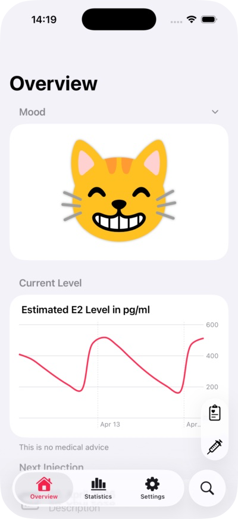
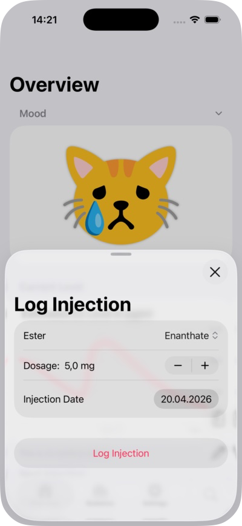
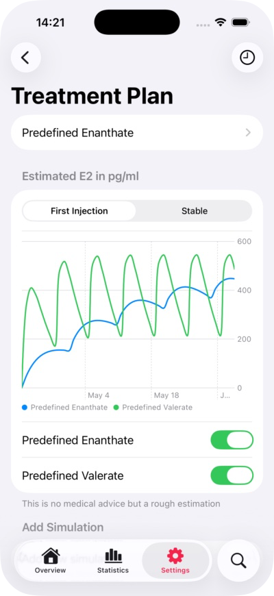

# Spirit Level (WIP)

I was playing around with different hormone planners for feminizing HRT with injectable estrogen and encountered a bunch of problems. There was no good way of persisting data, no option to sync data, and they were just not fun to use. So I set out to fix it. Beyond the estimated hormone levels, you get an option to store your lab results. You can create and compare plans and be reminded when your injection date is due. To take care of the fun part, there is a cat in the mood typically associated with the current hormone state.

### Supported Platforms

- iOS (tab view layout)
- iPadOS (split view layout)
- macOS (build for iPad)

### Requirements

- Xcode 26 or later
- iOS 26 or later (deployment target)
- Swift 6

### Dependencies

- [Lottie](https://github.com/airbnb/lottie-spm) (4.6.0+) — used for animated illustrations
- [SwiftLintPlugins](https://github.com/SimplyDanny/SwiftLintPlugins) (0.63.2+) — used for linting

### Deep linking

- Overview tab — spiritlevel://tab/overview
- Statistics tab — spiritlevel://tab/statistics
- Settings tab — spiritlevel://tab/settings
- Open log lab result — spiritlevel://quick/logLab
- Open log injection — spiritlevel://quick/logInjection

### App Intents

- Open log lab result (shortcut and intent)
- Open log injection (shortcut and intent)

### License

This project is licensed under the [MIT License](LICENSE).
